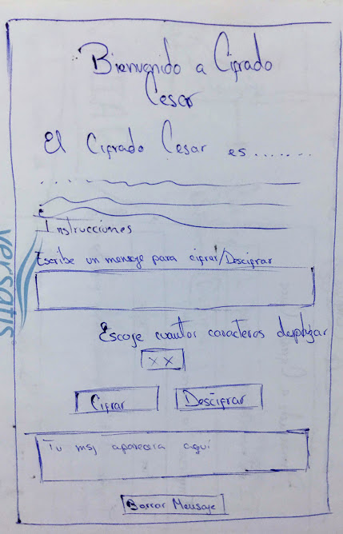
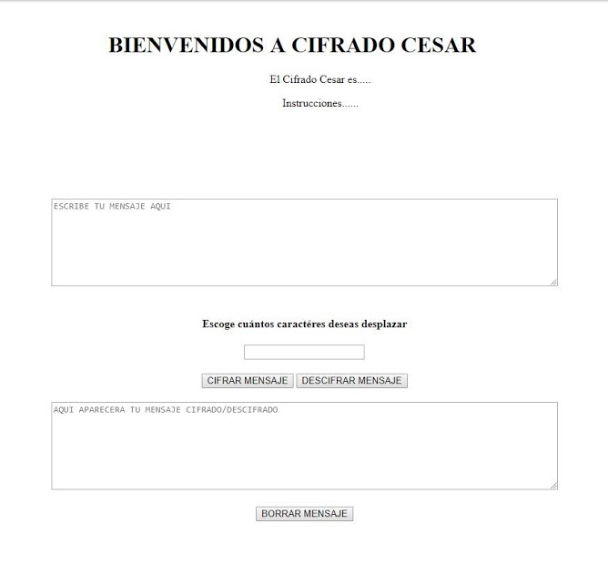
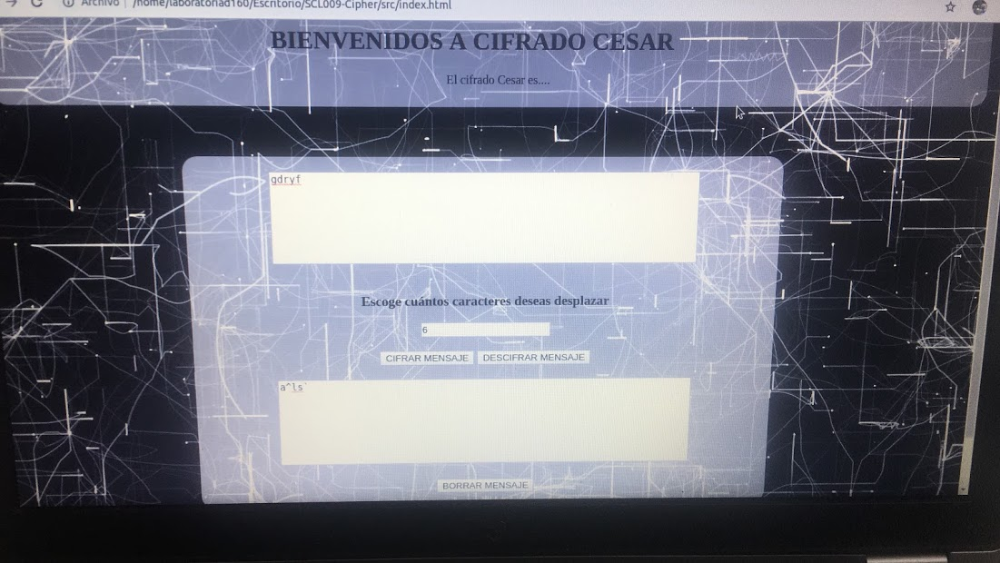
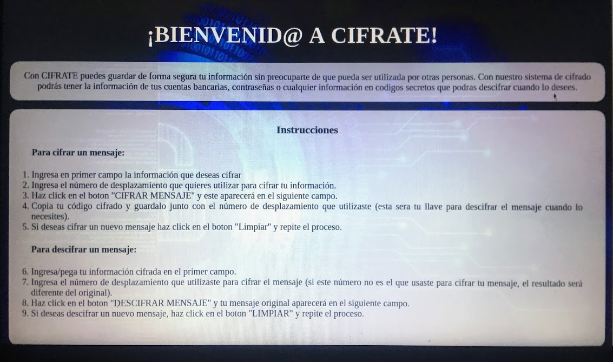
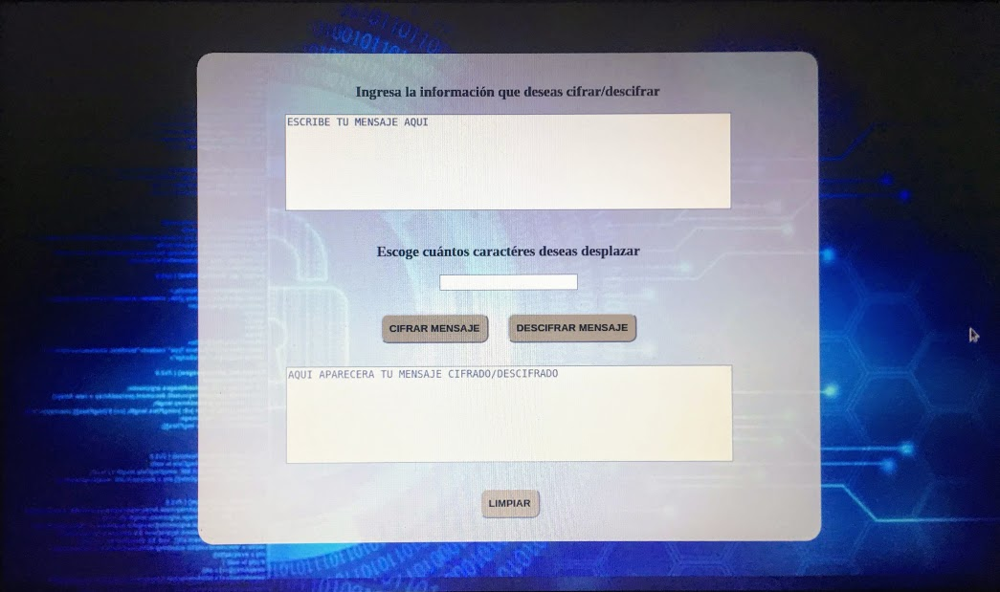

# ¡CIFRATE!

En la actualidad, la tecnología avanza cada vez mas rápido, y es necesario manejar y resguardar una cantidad importante de información que debe ser solo de uso personal, pero ¿Cómo logramos que esa información no sea utilizada por otras personas?

Para esto, se ha creado ¡CIFRATE! una aplicación que te permite codificar cualquier información que necesites mantener confidencial.

### ¿Cuál es el objetivo principal de esta aplicación? 

CIFRATE, se ha desarrollado para que podamos mantener la confidencialidad de la información que solo debe manejar un usuario, como por ejemplo:
* Información Bancaria (Cuentas, datos de ingreso a banca online).
* Redes Sociales (Instagram, Facebook, Twitter).
* Portales de compra online (Amazon, Aliexpress).
* Portales de servicios (Registro Civil, SII, Fonasa)
* Y cualquier página o aplicación que requiera información confidencial para su ingreso.
 
 Con CIFRATE los usuarios pueden guardar de forma segura su información sin preocuparse de que pueda ser utilizada en caso de que alguien la obtenga, pues al tener el mensaje cifrado solo deberan guardarlo junto con el código de desplazamiento y podrán descifrarlo en la aplicación cuando lo deseen.

### ¿Quiénes pueden usar CIFRATE?

* Todas las personas que tengan acceso a internet y deseen almacenar o compartir de forma segura su información.

### ¿Cómo usar CIFRATE?

* Para cifrar:
    
    1. Ingresa en primer campo la información que deseas cifrar
    
    2. Ingresa el número de desplazamiento que quieres utilizar para cifrar tu información.
    
    3. Haz click en el boton "CIFRAR MENSAJE" y este aparecerá en el siguiente campo.
    
    4. Copia tu código cifrado y guardalo junto con el número de desplazamiento que utilizaste (esta sera tu llave para descifrar el mensaje cuando lo necesites).
    
    5. Si deseas cifrar un nuevo mensaje haz click en el boton "Limpiar" y repite el proceso.

* Para descifrar:
  
    1. Ingresa/pega tu información cifrada en el primer campo.
    
    2. Ingresa el número de desplazamiento que utilizaste para cifrar el mensaje (si este número no es el que usaste para cifrar tu mensaje, el resultado será diferente del original).
    
    3. Haz click en el boton "DESCIFRAR MENSAJE" y tu mensaje original aparecerá en el siguiente campo.
    
    4. Si deseas descifrar un nuevo mensaje, haz click en el boton "LIMPIAR" y repite el proceso.

### Diseño:

Con la finalidad que el usuario navegue intuiivamente en la aplicación, sin necesidad de hacer cambios de pantalla para una mejor adaptabilidad; el diseño se realizó en una sola página donde se muestra todo el contenido.

Se estructuró de la siguiente manera:

* Bienvenida a la página.
* Breve introducción para que el usuario se identifique con el objetivo de la aplicación.
* Instrucciones para cifrado y descifrado de información.
* Cuadro de texto 1 (Para ingresar la información que se desea cifrar o descifrar).
* Desplazamiento (Número de caractéres que el usuario escoge desplazar para cifrar/descifrar su mensaje).
* Boton para Cifrar el mensaje ingresado en el Cuadro de texto 1.
* Boton para Descifrar el mensaje ingresado en el Cuadro de texto 1.
* Cuadro de texto 2 (En este espacio aparecerá el mensaje cifrado/descifrado de acuerdo a los parámetros que indique el usuario)
* Boton "LIMPIAR" (elimina el contenido de todos los pasos anteriores y permite que el usuario ingrese nuevos datos).

#### Prototipo de baja fidelidad realizado durante el primer sprint del proyecto.

#### Primera vista realizada de acuerdo al prototipo de baja fidelidad.

#### Probando CSS

#### Pantalla para entrega (parte 1)

#### Pantalla para entrega (parte 2)
